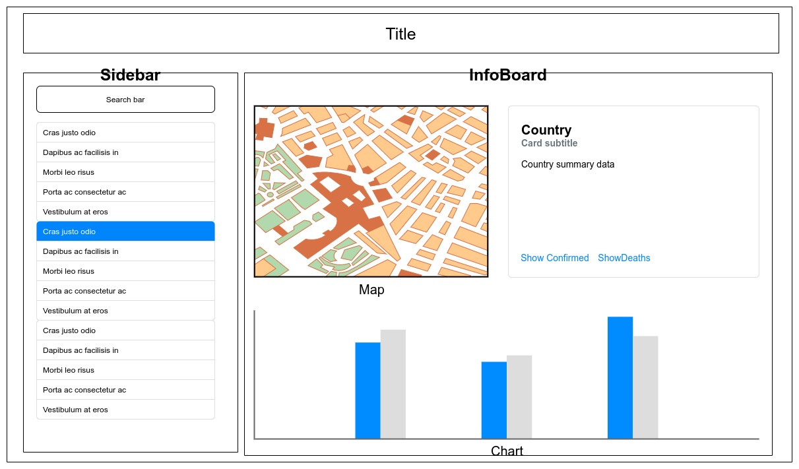

# COVID-19 API Data

## Introduction

This application fetches data from [Covid-19-API](https://github.com/M-Media-Group/Covid-19-API) and displays them in an informative way.

## Methods

### Components List

|Component|Contains|ChildOf|
|---------|--------|-------|
|App|header, `routes`|none|
|Landing|infotext, *?map-infographics*|Layout|
|Layout|Sidebar, Infoboard|App|
|Sidebar|searchbar, countries[`props`]|App|
|InfoBoard|Map, InfoCard, Chart|Layout|
|Map|mapcontainer, geojson[`local data`, `state data`]|InfoBoard|
|InfoCard|countrydata[`api data`, `props.filter`]|InfoBoard|
|Chart|countrydata[`api data`, `props.filter`]|Infoboard|

### Represented data

- Sidebar
    - list of countries derived from COVID-19 api countries list

- InfoCard
    - Country info from COVID-19 api
        - Country name
        - Population
        - Area
        - Confirmed cases
        - Death cases
        - Last updated

- Map 
    - Baselayer from OpenStreetMap
    - Vector layer from processed geojson data derived from NaturalEarthData `@50m_admin_0 level`

- Chart
    - Linechart for country's history of confirmed/death cases
    - Piechart for country's percentage population of vaccinated individuals

### App method

- Selecting country
    - Searchbar with controlled onChange listener to filter the list of selectable countries
        - match regex
    - *future*: radio button to select search by parameters
        - name
        - ISO A2
        - ISO N3
    - Use `ISO_A2` for unambiguity
    - onClick sets routing country `ab` (`ISO_A2`)

- Bounding box
    - When a country is selected, map should zoom to bbox value from geoJSON

- Routing
    - 
    - App routing to be based on **ISO A2**
    - ~~~js
        "/"
        "/home"
        "/country/:ab"
      ~~~

## Wireframe

## Technology

|name|description|
|----|----|
|[React](https://reactjs.org/)|JS frontend library|
|[Leaflet](https://leafletjs.com/)|JS library for maps|
|[React-leaflet](https://react-leaflet.js.org/)|React component library|
|[Recharts](https://recharts.org/en-US/)|React charting component library|
|[Covid-19-API](https://github.com/M-Media-Group/Covid-19-API)|Datasource API|

## Workplan

### MVP

- User should be able to perform a country search to display the data
- Data page will show basic info and a map view, focused on the country

### Future Features

- Global heatmap showing recent confirmed cases
- Landing page with interactive global map, also to be used for navigation 

### Progress

|Task|Not started|In-progress|Completed|
|----|:---------:|:---------:|:-------:|
|Project setup|||:heavy_check_mark:|
|Planning and Wireframing|||:heavy_check_mark:|
|API quick test|||:heavy_check_mark:|
|Determine core components|||:heavy_check_mark:|
|Build routes|||:heavy_check_mark:|
|Build Infoboard|||:heavy_check_mark:|
|Build Map|||:heavy_check_mark:|
|Build Chart (history linechart)|||:heavy_check_mark:|
|Build Chart (vaccination piechart)|||:heavy_check_mark:|
|Build Navbar|||:heavy_check_mark:|
|Build Layout component|||:heavy_check_mark:|
|Build country page|||:heavy_check_mark:|
|Build Sidebar|||:heavy_check_mark:|
|Build Infocard||:heavy_check_mark:||
|Build Landing page (global map infographic)|||:heavy_check_mark:|
|Better formatting|||:heavy_check_mark:|

## Acknowledgements

Data is retrieved from [Covid-19-API](https://github.com/M-Media-Group/Covid-19-API)

Supplementary geodata is obtained from [natural-earth-vector github repo](https://github.com/nvkelso/natural-earth-vector). 

Map base layer is served from [OpenStreetMap](https://www.openstreetmap.org/)